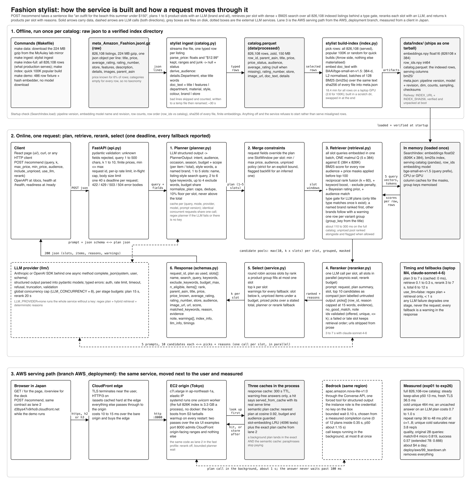

# Fashion stylist, a semantic recommendation microservice

Natural-language shopping over the Amazon Fashion catalog.

* Input: a sentence. "I need an outfit to go to the beach this summer".
* Output: 1 to 5 product slots (swimsuit, cover-up, sandals, sun hat, sunglasses), real
  items per slot, a one-line reason each.
* Pipeline: LLM query plan -> hybrid retrieval (bge-small embeddings + bm25) -> LLM
  rerank -> select. FastAPI `POST /recommend`, CLI, React page.
* Runs with no API key (regex planner, retrieval order, fewer slots).
* This branch adds a live AWS deployment: 57 ms steady p50 from Japan. Section below.

Five minutes: quick start -> sample output -> design decisions. Assessing: evaluation ->
performance -> the deck at `/overview` (`docs/overview.html`, animated request flow).

## Why this exists

* Keyword search dies on "what should my husband wear to an outdoor wedding in june".
* This turns that sentence into 3 to 5 shoppable slots with constraints applied.
* Every answer carries its plan, warnings, per-stage timings and token counts.
* No GPU, no vector database, no external service except one optional LLM key.

## Quick start (2 minutes, no dataset download, no API key)

Needs python 3.12 and [uv](https://docs.astral.sh/uv/). Uses the 486 row sample shipped
in the repo; one ~130 MB model download, offline after that.

```bash
make setup      # creates .venv and installs everything
make demo       # ingest the sample + build a tiny index, about a minute
INDEX_DIR=data/demo/index make serve
```

UI at http://localhost:8000, OpenAPI at `/docs`, walkthrough deck at `/overview`. Or:

```bash
curl -s localhost:8000/recommend -H 'content-type: application/json' \
  -d '{"query": "warm boots for snow", "k": 2}' | python -m json.tool
```

No key: regex planner, retrieval order, fine for single-product queries. For outfit
decomposition and reasons, put a key in `.env` (copy `.env.example`):

```
ANTHROPIC_API_KEY=sk-ant-...      # or OPENAI_API_KEY=sk-...
LLM_MODEL=claude-sonnet-4-6       # optional. the default is the model every number here was measured with
LLM_RERANK_MODEL=claude-haiku-4-5-20251001   # optional, a cheaper model for the per-slot rerank calls
```

`llm_info` in every response reports the model, call count and token usage.

## The real catalog

```bash
make data       # downloads meta_Amazon_Fashion.jsonl.gz, 224 MB, 826,108 products
make ingest     # -> data/processed/catalog.parquet, ~30 s
make index      # embeds + indexes the 100K most rated products, ~3 min on an M-series
                # laptop, 6-10 min on cpu. LIMIT=20000 make index for something quicker
make serve
```

* `make index-full`: all 826K rows. 19 min on laptop gpu, 40+ min cpu, 3.3 GB RSS to
  serve (vs 1 GB for 100K).
* `--sampling random`: seeded long-tail sample. Popular is the default on purpose; see
  design decisions.

## How it works



(`docs/architecture.pdf` is the same picture.) Offline: `ingest` -> typed parquet;
`build-index` -> bge-small-en-v1.5 embeddings (384-d, local) + bm25 over the same text.
Online, four stages:

1. **Plan.** Structured `QueryPlan`: 1 to 5 slots, each with a listing-style search
   query + title keywords; audience, occasion, season, budget, brand. Structured output
   on both providers, no free-text parsing. No key / failure / timeout -> regex planner,
   one slot.
2. **Retrieve.** All slot queries embedded in one batch, one matmul against the index;
   bm25 scores every row. Masks (audience, price) apply *before* top-N. RRF fusion.
   Variants collapse to one row. Named brand ranks first (hard filter with enough typed
   rows, else preference + warning). Type gate for LLM plans: once k typed candidates
   exist, off-type rows drop.
3. **Rerank.** One LLM call per slot, parallel, up to 10 candidates each. Picks
   validated against the candidate set and product type; failed slot keeps retrieval
   order.
4. **Select.** Top k per slot; a product fills one slot only; warnings name every
   fallback; per-stage timings in the response.

## Sample usage

Beach query via CLI (`uv run stylist recommend "..." --k 2`), 100K index, Sonnet:

```
query: I need an outfit to go to the beach this summer
plan (llm): Outfit for a beach day this summer

[swimsuit]  search: women's swimsuit one piece or bikini summer beach
  1. SheIn Women's One Piece Swimsuit Sleeveless Asymmetrical Bikini Cut Out Monokini Orange La
     price n/a | 4.6 stars (26) | https://www.amazon.com/dp/B08R5YVDB9
     High rating 4.6, women's one-piece monokini, beach summer style
  2. Dokotoo Womens Ladies Summer Beach Stripes Color Block One Piece Bathing Suit Swimsuit Mon
     price n/a | 4.3 stars (36) | https://www.amazon.com/dp/B01N5IB4AO
     Good rating 4.3, beach stripes color block one-piece, summer vibe

[cover-up]  search: women's beach cover up dress summer lightweight
  1. Imagine Women's Summer Dress Strapless Floral Print Bohemian Casual Beach Dress Cover Ups 
     price n/a | 4.1 stars (3,453) | https://www.amazon.com/dp/B07R1XGJZ2
     High rating 4.1, 3453 ratings, floral boho beach style, women
  2. Yonala Women's Summer Beach Wear Bikini Swimsuit Cover Up Swimwear Beach Dress,White, One 
     price n/a | 4.1 stars (24) | https://www.amazon.com/dp/B0796L86KM
     Rating 4.1, classic white beach cover-up, women's summer

[sandals]  search: women's beach sandals summer flat
  1. Mu Dan Women's Thong Flat Gladiator Summer Sandals
     price n/a | 4.0 stars (79) | https://www.amazon.com/dp/B01ESNNRZE
     Flat gladiator sandal, women's, beach-ready, highest rating count
  2. Amlaiworld Women Walking Sandals Summer Bohemia Sweet Beaded Sandals Comfortable Flat Beac
     price n/a | 4.0 stars (35) | https://www.amazon.com/dp/B07QKFHWWB
     Flat beach water sandal, bohemian summer style, solid rating

[sun hat]  search: women's sun hat beach summer wide brim
  1. Sun Hat for Women Wide Brim Hat Sun Visor for Women UV Protection Summer Beach Fishing Hat
     price n/a | 4.5 stars (22) | https://www.amazon.com/dp/B08FGPGK82
     High rating, UV protection, wide brim, perfect beach summer style
  2. Women's Large Wide Brim Floppy Straw Hat Summer Beach Sun Hat w/ Bow Ribbon
     price n/a | 3.4 stars (84) | https://www.amazon.com/dp/B019WB49KY
     Classic straw floppy hat, great beach summer look, variety in style

[sunglasses]  search: women's sunglasses beach summer UV protection
  1. UV-BANS Polarized Aviator Sunglasses for Women Uv Protection, Round Sunglasses, Oversized 
     price n/a | 4.3 stars (60) | https://www.amazon.com/dp/B07CSQ5FVJ
     Polarized, women's, multiple beach-ready styles, higher rating
  2. LianSan Fashion Sunglasses for women oversized Uv400 Protection Women's Sunglasses 13038 (
     price n/a | 3.9 stars (27) | https://www.amazon.com/dp/B00K3JSCB2
     Oversized UV400, women's, fun purple color for beach

note: Here are two lovely cover-ups to keep you stylish and sun-protected at the beach! Stay shaded in style with a UV-protective wide brim or a classic straw floppy hat! These stylish one-pieces are perfect for a fun summer beach day! These stylish shades will keep your eyes protected and beach-ready all summer! These cute flat sandals are perfect for strolling the beach this summer!

timings: {'plan_ms': 6698.5, 'retrieve_ms': 234.9, 'rerank_ms': 4623.6, 'total_ms': 11557.3}  (planner=llm, rerank=True, index rows=100000)
```

HTTP, explicit per-item bound (only known prices inside it are eligible), trimmed:

```bash
curl -s localhost:8000/recommend -H 'content-type: application/json' -d '{
  "query": "warm waterproof boots for hiking in the snow",
  "k": 2, "max_price": 80
}'
```

```json
{
  "request_id": "40e5b9943aa4",
  "query": "warm waterproof boots for hiking in the snow",
  "plan": {
    "intent": "Find warm waterproof boots suitable for hiking in snowy conditions",
    "audience": null,
    "season": "winter",
    "budget_max": null,
    "budget_scope": "unknown",
    "brand": null,
    "source": "llm",
    "slots": [
      {
        "name": "hiking boots",
        "search_query": "waterproof insulated snow hiking boots",
        "keywords": [
          "hiking boots",
          "snow boots",
          "winter boots",
          "trekking boots"
        ],
        "exclude_keywords": [
          "rain boot",
          "wellington",
          "casual"
        ],
        "budget_max": null
      }
    ]
  },
  "slots": [
    {
      "name": "hiking boots",
      "search_query": "waterproof insulated snow hiking boots",
      "keywords": [
        "hiking boots",
        "snow boots",
        "winter boots",
        "trekking boots"
      ],
      "exclude_keywords": [
        "rain boot",
        "wellington",
        "casual"
      ],
      "budget_max": 80.0,
      "n_eligible": 10,
      "eligible_rows": 13181,
      "items": [
        {
          "rank": 1,
          "row_id": 272668,
          "parent_asin": "B01MG8KYVS",
          "title": "Karrimor Hot Rock Mens Walking Boots Waterproof Lace Up",
          "price": 73.99,
          "price_known": true,
          "average_rating": 4.3,
          "rating_number": 42,
          "store": "Karrimor",
          "audience": "men",
          "image_url": "https://m.media-amazon.com/images/I/41gTZoB8cWL._AC_.jpg",
          "url": "https://www.amazon.com/dp/B01MG8KYVS",
          "score": 0.032881,
          "matched_keywords": [],
          "reason": "Waterproof hiking boot, within budget, good rating",
          "evidence": [
            "title",
            "price",
            "rating",
            "features"
          ]
        },
        {
          "rank": 2,
          "row_id": 24576,
          "parent_asin": "B003VWBN46",
          "title": "Nevados Men's Klondike Mid Waterproof Hiking Boot | Lightweight for Trail, Walking, Summer",
          "price": 75.0,
          "price_known": true,
          "average_rating": 4.2,
          "rating_number": 418,
          "store": "Nevados",
          "audience": "men",
          "image_url": "https://m.media-amazon.com/images/I/41KQpNlBVPL._AC_.jpg",
          "url": "https://www.amazon.com/dp/B003VWBN46",
          "score": 0.037101,
          "matched_keywords": [
            "hiking boots"
          ],
          "reason": "Waterproof hiking boot, memory foam, within budget",
          "evidence": [
            "title",
            "price",
            "rating",
            "features"
          ]
        }
      ]
    }
  ],
  "note": "These waterproof hiking boots should keep your feet dry and comfortable in snowy trails!",
  "warnings": [],
  "index_info": {
    "rows": 100000,
    "sampling": "popular",
    "limit": 100000,
    "embedding_model": "BAAI/bge-small-en-v1.5",
    "built_at": "2026-08-23T12:17:24Z"
  },
  "llm_info": {
    "provider": "anthropic",
    "model": "claude-sonnet-4-6",
    "planner_used": "llm",
    "rerank_used": true,
    "rerank_model": null,
    "plan_cache_hit": false,
    "calls": 2,
    "failed_calls": 0,
    "input_tokens": 4087,
    "output_tokens": 236
  },
  "timings": {
    "plan_ms": 3577.3,
    "retrieve_ms": 89.1,
    "rerank_ms": 3497.3,
    "total_ms": 7163.9
  }
}
```

Fields to know: `price_known` (real vs missing price), `matched_keywords` + `evidence`
(receipts behind `reason`), `warnings` (every fallback), `llm_info.planner_used` (llm or
regex). Full request schema at `/docs`.

The UI is the same call with product cards:


## What i explored before writing code

Day one was scripts, not code. Short version (`docs/exploration.md` has the long one):

* Profiled all 826,108 rows: `categories` empty on every row, `bought_together` always
  null, price a float on 6.1%, description on 7%. Every row: title (median 89 chars,
  packed with brand, gender, type, colour, size), rating, image. The title carries the
  system.
* Embedding shootout (bge-small vs bge-base vs minilm, 8 probe queries): bge-small,
  same quality, 761 docs/s on the laptop.
* Prices: floats and clean strings kept by `parse_price`; ranges and junk -> null with
  a status. Nothing guessed.
* Audience: `details.Department` covers ~half, title words most of the rest, ~13%
  unknown = wildcard (never filtered out).
* Prompt experiments, in order: listing-style search queries (type match 0.73 -> 0.88),
  keywords = type synonyms only, one rerank call per slot (20 s -> 3-7 s), type before
  price, exclude penalty = boost, budget floor 10% per slot, reasons capped at 15 words.
* Dead ends: hand-built taxonomy (upkeep beats gain), variant key baked into the index
  (a regex fix wouldve cost a 20 min rebuild).

## Design decisions and trade-offs

**What the data contains.**

* No taxonomy (`categories` empty everywhere), no bundle signal (`bought_together` null).
* Price on 6.1% of rows, description on 7%. Title, rating, image on 100%.
* So: the title carries retrieval; everything else is extras.

**Popular-first subset by default.**

* Full index: 19 min gpu / ~45 min cpu build, 3.3 GB RSS. 100K most-rated: ~3 min, 1 GB.
* Metadata quality rises with popularity: price known 26% vs 5%, features 79% vs 50%,
  department 49% vs 12% (100+ ratings vs 0-4).
* Cost: the long tail. `--sampling random` / `all` exist, `index_info.sampling` is in
  every response, the evaluation runs all three.

**Hybrid retrieval, masks before top-N.**

* Dense wins conversational phrasing; bm25 wins brands and exact phrases; RRF (k=60)
  fuses without calibration.
* The point i'd defend hardest: constraints are boolean masks on full score vectors,
  applied *before* top-N. Post-filtering silently empties slots when eligible items sit
  at rank 61+. With masks, one matching women's sandal under $30 anywhere in the index
  is found.
* Additive extras: keyword boost, Bayesian rating prior (4.8 from 500 beats 5.0 from 1).

**Variants.**

* 56,720 duplicate titles under different ids, plus size/colour twins.
* `group_key` = lowercased title minus trailing parens, sizes, colour segments.
* Computed at query time on purpose: a grouping bug fix must not need a 20 min rebuild.
* One row per group survives; a group fills at most one slot per outfit.

**Prices: strict when you say so, flagged when i guessed.** 94% of items have no price.

* Explicit `max_price` in the request: only known prices inside it are eligible.
* Budget inferred from the sentence: unpriced items allowed, `price_known: false` +
  warning. Otherwise slots go empty or a priced wooden ring wins the blazer slot (seen
  it happen).
* `include_unpriced` overrides either way. Total budgets split by the planner: 10% floor
  per slot, parts never exceed the total.

**Product type is a hard constraint, like price.** The first eval filled "running shoes
for flat feet" with insoles: every channel scores "arch support flat feet".

* LLM plans gate on type once k typed matches exist.
* Head noun counts ("rain jacket" accepts any jacket); an accessory word next to the
  type word vetoes ("Shoe Insoles").
* Reranker picks pass the same rule. Brand gets its own pass first; short of k typed
  rows it degrades to a preference and says so.
* Effect: match@k 0.83 -> ~0.89; brand queries 1/4 -> 3-4 of 4 on-brand (ADR-0015).

**LLM reranker, one call per slot.**

* Input: compact json per candidate (title, price or null, rating, audience,
  material/colour/style, matched keywords). Priority order: type, occasion, price,
  ratings.
* Five slots = five parallel calls; a failing slot never takes the others down.
* Safety: catalog text labelled untrusted, request passed as json data, ids validated
  against candidates + type, reasons link-stripped and capped at 15 words, evidence
  checked against the candidate.
* Why not a cross-encoder here: cant reason about "for my 6 year old" or "200 total",
  writes no reasons. It is the right sub-second tool in `docs/production.md`.

**Deadlines.** One 40 s request deadline over everything. Planner max 15 s, reranker
20 s, a stage skips when under its minimum. Every provider failure: typed error,
fallback path, test. Laptop numbers: plan 2-6 s, retrieve 50-300 ms, rerank 3-7 s.

**Providers behind one protocol.** `complete_json(system, user, schema)` is the whole
interface. Anthropic / OpenAI / Bedrock adapters, ~70 lines each, no framework.
`LLM_RERANK_MODEL` puts a cheaper model on the rerank calls, where the tokens go.

## Evaluation

`scripts/evaluate.py`: 28 queries (20 conversational + 8 brand), several configs, three
indexes.

* `match@k` = share of returned items whose title passes a hand-written type rule for
  its slot (sandals slot accepts sandal / flip flop / slide / espadrille; brand rules
  need brand + type).
* Rules written before looking at any output. A type-correctness floor, not a relevance
  judgement; blind to style.
* Same 28 plans on every index -> paired comparisons.
* Macro averages with bootstrap intervals, mapped precision, slot recall, strict query
  success, paired deltas: `docs/evaluation.md`.

| config (what runs) | popular 100K | random 100K | full 826K |
|---|---|---|---|
| bm25 only, regex planner | 0.500 | 0.562 | 0.652 |
| dense only, regex planner | 0.696 | 0.696 | 0.786 |
| hybrid, regex planner | 0.625 | 0.679 | 0.750 |
| hybrid, LLM planner | 0.881 | 0.881 | 0.935 |
| dense only, LLM planner | 0.862 | 0.877 | 0.923 |
| hybrid, LLM planner + LLM rerank (the default path) | 0.885 | 0.885 | 0.935 |

k=4 per slot, `claude-sonnet-4-6`, prompt version 2, commit sha in each json file.

* Zero empty slots, zero price violations, every run.
* Macro (full pipeline): 0.857 (95% CI 0.76 to 0.94) on popular, 0.967 (0.94 to 0.99)
  on full.
* Latency: p50 ~5.5 s warm plan cache, 11.5 s cold; retrieval alone 22 ms (100K) /
  110 ms (full).

Reading it:

* The planner is the win: raw sentence 0.63 to 0.75, planner queries 0.88 to 0.94.
* bm25 alone unusable for sentences; kept becuase it carries brand tokens. Channels
  within 2 points under the planner.
* Reranker adds ~1 point of type-match; its real job is constraints, reasons, off-type
  vetoes.
* Full catalog beats 100K (0.935 vs 0.885) on brands and long tail, not on type. The
  trade: 3 min build, 1 GB RAM.

## Performance and cost, measured

Retrieval only (`use_llm=false`), one process, M4 laptop pinned to cpu, 60 requests per
setting (`scripts/benchmark.py`, raw numbers in `docs/bench_cpu.json`):

| concurrency | p50 | p95 | req/s |
|---|---|---|---|
| 1 | 22 ms | 32 ms | 42 |
| 2 | 33 ms | 41 ms | 58 |
| 4 | 65 ms | 82 ms | 62 |
| 8 | 126 ms | 145 ms | 62 |

* Flattens ~60 req/s per process; past that, replicas beat threads.
* RSS: 1.0 GB (100K) / 3.3 GB (full). Index load 0.1 s incl. sha256 of every file.
* Full pipeline (Sonnet, 20-query live run, `docs/live_run_sonnet.json`): plan p50
  5.2 s, retrieve 0.13 s, rerank 5.9 s, total 11.5 s (p95 13.5 s), 3.9 calls/request.
  8-way burst: 18.5 s, zero errors.
* Cost/request from reported tokens: $0.036 Sonnet-class, $0.012 Haiku-class. 10K/day:
  ~$360 measured; ~$200 with 90% plan-cache hits + prompt caching; under $100 with a
  Haiku reranker.
* Capacity ceiling = provider TPM quota, not CPU.
* Sub-second path (semantic plan cache, distilled 1-3B planner, cross-encoder rerank,
  big model as async refinement): `docs/production.md`. First rungs are deployed and
  measured below: 57 ms steady p50.

## Deployment

* `Dockerfile`: cpu-only, python 3.12 slim, uv, pinned model revision, non-root. By
  default **bakes a 40K demo index** into the image (~4 min on a cpu builder); no
  volume, no external files.
* `--build-arg BAKE_INDEX_LIMIT=0` skips baking. Then: volume at `/app/data`, or
  `INDEX_URL` + `INDEX_SHA256` (tarball from `make index-tar`; size-capped download,
  checksum, member/path checks, loader-validated, locked swap).

Knobs for real traffic (env variables, defaults in brackets):

* Limits: `RATE_LIMIT_PER_MINUTE` [60, burst = a sixth], `MAX_INFLIGHT_REQUESTS` [16],
  `MAX_BODY_BYTES` [16384], `LLM_CONCURRENCY` [8].
* Deadlines: `REQUEST_DEADLINE_S` [40], `PLANNER_BUDGET_S` [15], `RERANK_BUDGET_S` [20].
* Posture: `TRUST_PROXY_HEADERS` [off; the image sets it], `CORS_ALLOW_ORIGINS` [none],
  `STARTUP_FAIL_FAST` [off], `LOG_QUERIES` [off], `INDEX_ALLOW_PRIVATE_URL` [off].
* Fast profile (this branch): `LLM_PROVIDER=bedrock` + `BEDROCK_REGION`,
  `PLANNER_CALL_TIMEOUT_S` [20, the background call's own clock], `RERANK_DEFAULT`
  [on; AWS profile turns it off], `SEMANTIC_PLAN_CACHE` [off] +
  `SEMANTIC_PLAN_THRESHOLD` [0.92], `RESPONSE_CACHE_TTL_S` [0 = off].
* Sizing behind the defaults: `docs/production.md`.

`railway.toml`: Dockerfile builder, `/ready` health check, `PORT` auto. Add a key as a
service variable after the first deploy; keyless runs in regex mode. From a clone:

```bash
npm i -g @railway/cli && railway login
railway init          # new project
railway up            # uploads this directory and builds the Dockerfile
railway domain        # public url
railway variables --set ANTHROPIC_API_KEY=sk-ant-...
```

* No Docker on this machine, so CI (`.github/workflows/ci.yml`) builds the image,
  indexes the fixture inside it and hits `/ready` + `/recommend`. Railway builds it too.
* `/health` always answers; `/ready` is 503 until the index is in memory.
* Production shape i'd run: 2 vCPU / 4 GB per replica (8 GB full index), 1 worker per
  replica, 3 replicas, autoscale on in-flight, index tarball pinned by URL + sha256,
  Redis for the shared plan cache, key in the secret store.
* Degradation ladder: planner fails -> regex (30 s negative cache); one rerank call
  fails -> that slot keeps retrieval order; reranker rejects all -> type matches or an
  honest empty slot; no index -> 503 + `/health` explains; no key -> plain search.
  Every degradation lands in `warnings` or `llm_info`.
* Before real traffic: json logs, OpenTelemetry per stage, Prometheus histograms,
  alerts on p95 / fallback rate / 429s, provider circuit breaker, off-domain filter.
  Tools and pass conditions: `docs/production.md`.

## The AWS deployment on this branch

Goal: prompt to result under 0.5 s. Main keeps the provider-neutral service; this
branch adds the fast profile, the AWS scripts and the measurements. us-east-1 first,
Tokyo second (most of the remaining time was the Pacific). Live while the demo runs:
https://d3bys47v9rho9.cloudfront.net. ~$4/day, one teardown script.

Topology:

* CloudFront: edge TLS, HTTP/3, `/assets` cached hard, rest pass-through.
* EC2 origin: c7i.xlarge, ap-northeast-1a, systemd, 2 uvicorn workers, no docker (boots
  from a source tarball in S3). Port 8000 admits CloudFront origin-facing ranges only.
  No ssh keys; ops via SSM.
* Bedrock in-region: `apac.amazon.nova-lite-v1:0`, structured output via one forced
  tool, instance role as the only credential.

Fast profile (same codebase, env settings):

* Bounded planner wait: `PLANNER_BUDGET_S=0.10`, then the regex plan answers. The
  Bedrock call runs on its own 20 s clock and lands in the caches. 0.10 is measured,
  not taste: 0/12 plans inside 0.35 s (Micro p50 999 ms, Lite 1154 ms).
  `deploy/aws/planner_cdf.py` reproduces it.
* Background plans land in the exact AND semantic plan cache (cosine 0.92, budget +
  audience guard). Paraphrases ride plans they never paid for.
* Response cache (`RESPONSE_CACHE_TTL_S=300`): warning-free answers only, so a degraded
  fallback is never frozen. Hits carry `served_from_cache: true` + real serve time.
* Slot-embedding LRU: warm 5-slot request = sub-ms server time. Background planner
  admission capped at 8: cold floods degrade to regex, never an unbounded Bedrock queue.
* Warmup on restart: two passes over the six UI examples (start plans, then cache
  planned answers).

Measured from a client in Japan, wall time through CloudFront. Raw runs are files in
`deploy/aws/experiments/` (exp01 to exp19), the narrative with both rounds is
`docs/aws-latency.md`:

| path | us-east-1 | Tokyo |
|---|---|---|
| steady keep-alive p50 | 344 ms | 57 ms |
| warm repeat (response cache) | n/a | 13 to 44 ms |
| cold unique query | ~640 ms | 210 ms |
| plan-cache hit after the background fill | n/a | 112 ms |
| paraphrase via the semantic cache | 215 ms | 116 ms |
| direct origin, warm | n/a | 22 ms |

* Every row, cold included, under the 0.5 s target.
* Ramp (repeat mode, fresh TLS each request): p50 43 to 47 ms at c=1..8, 40 req/s,
  zero errors.
* Workers: 1-vs-2 measured; kept 2 (p50 within noise, better p95 at c=4/c=16, second
  failure domain).
* Quality, live, 28 queries, offline rules: Lite 0.772 match@4 micro vs Micro 0.705
  (success 0.50 vs 0.39) -> planner is Lite. Gap to Sonnet-planned local eval (0.885)
  is planner model quality; planning is background, so a bigger planner costs no
  latency.

Deploy: five region-generic scripts plus teardown (same scripts built both regions):

```bash
cd deploy/aws
./01_artifacts.sh                            # source + index tarballs into s3
./02_iam.sh                                  # role: s3 read, bedrock invoke, ssm
STYLIST_REGION=ap-northeast-1 ./03_ec2.sh    # sg from the cloudfront prefix list, eip, boot
./04_cloudfront.sh                           # one distribution, /assets cached, rest passes through
./05_test.sh                                 # probes through the distribution
./99_teardown.sh                             # removes all of it, both regions
```

### Tested like it will be used

Latency probes prove the fast path only. `deploy/aws/test_battery.py`: ten sections
against production, ~11,500 requests, zero 5xx outside the one induced restart window.
Raw results: `deploy/aws/experiments/exp20` to `exp22`.

| section | what it proves | result |
|---|---|---|
| contract (20 checks) | 422/413/405 with the documented error body, full response schema | 20/20 |
| endpoints + headers | UI, deck, /docs, /health, /ready; CSP, nosniff, frame DENY, h3 advertised; /assets served from the edge | all pass |
| guardrail envelope | 70 rapid requests: first 429 at request 65, throttles answer in 12 ms with a proper body, clean recovery in 20 s | pass |
| steady keep-alive, n=100 | the floor of the deployment | p50 12.8 ms, p99 16.9 ms, max 17.5 ms |
| fresh TLS per request, n=50 | what a first click pays | p50 34.9 ms, p99 70 ms |
| ramp, 21 cells, c=1..32 | repeat / unique / mixed workloads | 672 requests, zero errors |
| soak, 5 min at c=6 mixed | drift and leaks | 5,010 requests, 16.7 req/s, zero errors, per-minute p95 flat at 0.87 to 1.01 s, host memory flat at 1.8 to 2.1 GB |
| restart under traffic | the cost of a deploy | 6.7 s of 502/504, then full recovery |
| cache ladder, asserted | exact, semantic and response caches behave | pass |
| consistency, x5 | identical warm answers | identical |

Capacity, from the ramp:

* Repeat traffic: 36 to 52 ms p50 from c=1 to c=32, 100 req/s peak.
* Unique cold traffic: 4 vCPUs saturate at 10 to 13 req/s, p50 2.7 s at c=32, zero
  5xx, just queuing. Size replicas from this number, not the cache-hit one.

The bug the battery caught:

* Symptom: one worker 2.44 s server p50 on the beach query, the other 0.4 ms. Idle box.
* Trigger: a Nova Lite plan, 5 slots, $135 total budget. Tight price masks starved the
  type gate; the ranker widened x4 per pass; every pass hydrated every window row via
  per-row pandas iloc. 19,783 hydrations/request; 10.4 s under 12-way load.
* The response cache refused to mask it: degraded answers are never cached, by design.
* Fix: one vectorized column gather per window for scoring fields; row walk only for
  returned rows.
* Proof: captured plan 2,831 -> 985 ms cold replay; live steady p50 2,442 -> 12.8 ms;
  regression test counts hydrations; quality rerun unchanged (0.800 micro, 0.50
  success, 28/28 plans).
* Never showed on us-east-1 (Micro rarely emits budgets) or the local eval (Sonnet
  plans). Only live traffic walked it. That is the case for the battery.

Known limits, stated:

* Single origin: a deploy costs ~7 s of 5xx. Failover or a second box removes it.
* Rate limiter is per worker: effective burst is twice the configured one.
* Workers warm seperately: a cold query can answer differently for ~1 s.

A review pass ran before the Tokyo cutover: both cache rules above started as bugs it
caught, and worker count + planner budget were measured because it insisted.

## Tests

```bash
make test       # the whole fast suite, no model download, no keys, ~20 s
make test-all   # adds the real embedding model and, if keys are set, a live LLM round trip
make lint
```

Fast suite: determinstic hashed-ngram embedder + scripted fake LLM. Covers:

* Parsing + planning: price parsing, audience heuristic, plan normalisation (slot caps,
  budget splits, keyword cleanup, brand).
* Retrieval: masks, fusion, type gate, brand pass, variant grouping.
* LLM failure classes -> correct fallbacks; reranker output validation (unknown ids,
  duplicates, off-type picks, partial slot failure, link-stripped reasons); cross-slot
  uniqueness.
* Deadlines: stuck planner, waiter timeout, retrieval past deadline -> 504.
* API contract, error bodies, rate limit, in-flight cap, body cap, security headers.
* Index integrity: checksums, row alignment, tampered embeddings, swapped row ids,
  edited bm25 files, missing columns, pickled arrays. Artifact installs: archive bombs,
  private hosts, stale indexes, locks.
* CLI, evaluation scorer, regressions from the audit rounds.

CI: suite, ruff, bandit, pip-audit, docker smoke test on the fixture, `ui/dist` drift
check.

## Repository layout

```
src/stylist/
  catalog.py      raw jsonl -> parquet: price parsing, audience guess, variant key, doc text
  embeddings.py   sentence-transformers wrapper + a hashed embedder for tests
  index.py        build / load the index, checksums, one-matmul dense scores, bm25 scores
  planner.py      QueryPlan models, LLM planner, regex fallback, constraint merging
  retrieval.py    masks, reciprocal rank fusion, keyword boost, rating prior, grouping
  reranker.py     per-slot LLM rerank with validation and fallback
  service.py      the request pipeline: deadlines, plan cache, cross-slot selection
  schemas.py      API request / response models
  api.py          FastAPI app, /recommend /health /ready, serves the UI
  cli.py          download-data, ingest, build-index, recommend, serve
  artifacts.py    prebuilt index download for deployments
  llm/            provider protocol, anthropic + openai adapters, prompts, fake for tests
ui/               React + Vite front-end (dist/ is committed, the API serves it)
scripts/          evaluation, benchmark, fixture builder
deploy/aws/       five deploy scripts + teardown, probes, experiments exp01 to exp19
notebooks/        data exploration + embedding model comparison
docs/             architecture diagram, design notes, evaluation
tests/            pytest suite + the 486 row fixture
```

## More documentation

* `docs/prd.md`: the requirements, how each one is met, the success metrics.
* `docs/adr/`: sixteen decision records (embeddings, hybrid retrieval, masks before
  top-N, exact search, the default index, planner, reranker, price policy, variant
  grouping, providers, deadlines, index artifacts, serving stack, evaluation approach,
  the type gate and brand handling, request limits and fail-closed loading).
* `docs/design-notes.md`: the longer narrative behind the decisions.
* `docs/exploration.md`: the notebook, the scripts, and the prompt experiments in order.
* `docs/evaluation.md`: every number with its caveats.
* `docs/production.md`: measured latency, throughput and cost, what it costs at scale,
  how to get under a second, the recommended production setup, guardrails and
  observability, gaps with a dated plan, the tests still to run.
* `docs/aws-latency.md`: the AWS story in full, both rounds, every number and both
  bugs the review pass caught.
* `docs/overview.html` (also at `/overview`): the walkthrough deck with the animated
  data flow (19 slides, agenda on the left; slides 14 to 16 are the AWS build, its
  measurements and the acceptance battery).

## Limitations and what i would do next

* The eval has no human relevance labels. Keyword rules catch the wrong product type,
  they don't catch an ugly one. Labelling the 28 queries is the first thing i'd do with
  another day, its the obvious gap.
* No product taxonomy. The planner's keywords and the embeddings carry the type
  constraint; a cheap title-based type classifier would make the filters harder.
* Exact search only. Fine up to the full 826K rows in RAM, an ANN index or a hosted vector
  db is the next step past that.
* Every listing has an image and none of that is used. CLIP embeddings would allow "like
  this photo" queries and catch mislabeled titles.
* Variant grouping is string based. Two colourways with different titles still shows up as
  two items.
* Latency is dominated by the two LLM stages (6-15 s per request with Sonnet class
  models). Streaming the slots to the UI as they finish would hide most of it, didnt get
  to it. The AWS branch attacks the same problem from the other side: the planner moved
  out of the hot path entirely, and rerank is off in that profile.
* No outfit coherence scoring between slots yet: a floral shirt and a striped blazer can
  both win their slot. A colour/style pass over the top 3 per slot is sketched in
  `docs/production.md`, week 4-5 of the plan there.
* The load, soak, chaos and prompt-injection-corpus tests are specified (tools and pass
  conditions in `docs/production.md`) but not run; the fast suite plus the docker smoke
  test is what CI covers today.

## Data

Amazon Reviews 2023, fashion category metadata, McAuley Lab at UCSD
(https://amazon-reviews-2023.github.io/). `tests/fixtures/sample_500.jsonl.gz` is a
486 row sample of it included for tests and the demo. Research use.
