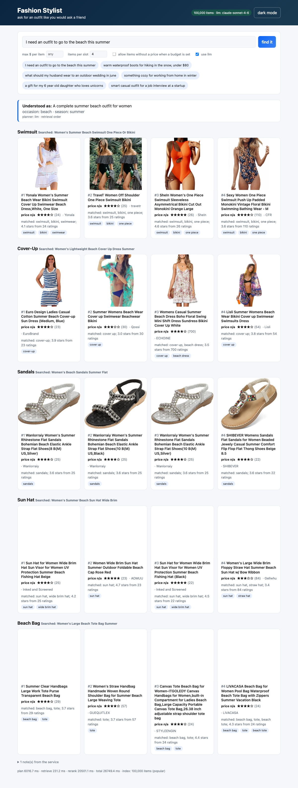

# Fashion stylist, a semantic recomendation microservice

Ask it for clothes the way you would ask a friend. "I need an outfit to go to the beach
this summer" comes back as a swimsuit, a cover-up, sandals, a sun hat and sunglasses, each
with a couple of real products from the Amazon Fashion catalog and a one line reason. A
plain request like "warm waterproof boots for hiking in the snow, under $80" comes back as
one slot with boots in it.

Under the hood its basicaly three steps: an LLM turns the sentence into a small retrieval plan
(which product types, for who, what budget), hybrid search (local text embeddings + bm25)
pulls candidates per product type out of an index of the catalog, and the LLM picks and
explains the final items. Exposed as a FastAPI endpoint (`POST /recommend`), a CLI, and a
small React page. Runs without any API key too, just with less magic (and less slots).

Table of contents is the headings below, i didnt bother with a real one. If you only have five minutes: quick start, then
the sample output, then design decisions.

## Quick start (2 minutes, no dataset download, no API key)

You need python 3.12 and [uv](https://docs.astral.sh/uv/). The demo uses a 486 row sample
of the real data that ships in the repo, and downloads the embedding model from hugging
face once (~130 MB), after that its all offline.

```bash
make setup      # creates .venv and installs everything
make demo       # ingest the sample + build a tiny index, about a minute
INDEX_DIR=data/demo/index make serve
```

Then open http://localhost:8000 for the UI, http://localhost:8000/docs for the OpenAPI
page, http://localhost:8000/overview for a short walkthrough deck of the whole thing, or:

```bash
curl -s localhost:8000/recommend -H 'content-type: application/json' \
  -d '{"query": "warm boots for snow", "k": 2}' | python -m json.tool
```

Without a key the service uses a regex planner and returns items in retrieval order, which
is fine for single product queries. To get the outfit decomposition and the explenations,
put a key in `.env` (copy `.env.example`):

```
ANTHROPIC_API_KEY=sk-ant-...      # or OPENAI_API_KEY=sk-...
LLM_MODEL=claude-sonnet-4-6       # optional. the default is the model every number here was measured with
LLM_RERANK_MODEL=claude-haiku-4-5-20251001   # optional. a cheaper model for the per-slot rerank calls
```

(the response always tells you which model ran, how many calls it took and how many
tokens they used, in `llm_info`.)

## The real catalog

```bash
make data       # downloads meta_Amazon_Fashion.jsonl.gz, 224 MB, 826,108 products
make ingest     # -> data/processed/catalog.parquet, ~30 s
make index      # embeds + indexes the 100K most rated products, ~3 min on an M-series
                # laptop, 6-10 min on cpu. LIMIT=20000 make index for something quicker
make serve
```

`make index-full` does all 826K rows (19 min on the laptop gpu, 40+ min on cpu, ~3.3 GB RSS to
serve vs ~1 GB for the 100K one).
`stylist build-index --sampling random --limit 100000` gives a seeded long tail sample
instead of the popular one. See "design decisions" for why popular is the default, its not an accident.

## How it works


(`docs/architecture.pdf` is the same picture.) Offline, `ingest` flattens the raw json
into a typed parquet file and `build-index` embeds a subset of it with
`BAAI/bge-small-en-v1.5` (384-d, runs locally) and builds a bm25 index over the same text.
Online, one request goes trough four stages:

1. **Plan.** The LLM returns a structured `QueryPlan`: 1 to 5 slots (product types), each
   with a product-listing style search query and a few title keywords, plus audience,
   occasion, season, budget and, when the shopper names one, a brand. Structured output
   on both providers, so no json parsing of free text. No key, a failure, or a timeout,
   and a regex planner takes over with one slot.
2. **Retrieve.** All slot queries are embedded in one batch and scored against the whole
   index with a single matrix multiply; bm25 scores every row too. Audience and price
   constraints are applied as masks *before* top-N, the two channels are fused with
   reciprocal rank fusion, and size/colour variants of the same product collapse to one.
   A named brand is ranked on its own first (a hard filter when it has enough rows of
   the right type, a preference with a warning otherwise), and for LLM plans a type gate
   keeps insoles out of a running shoes slot: once k candidates carry a type word in the
   title, off-type rows are dropped.
3. **Rerank.** One LLM call per slot, in parallel, with up to 10 candidates each. It
   returns ordered picks with a short reason and the fields it relied on. Everything it
   says is validated against the candidate set and the product type; a slot is only ever
   padded with type matches; if a call fails the slot keeps retrieval order, no
   exceptions.
4. **Select.** Top k per slot, a product can only fill one slot, warnings explain every
   fallback, timings per stage are in the response.

## Sample usage

The beach example from the brief, via the CLI (`uv run stylist recommend "..." --k 2`),
against the 100K index with `claude-sonnet-4-6`:

```
query: I need an outfit to go to the beach this summer
plan (llm): Complete beach outfit for summer

[swimsuit]  search: women's swimsuit beach summer one piece or bikini
  1. SheIn Women's One Piece Swimsuit Sleeveless Asymmetrical Bikini Cut Out Monokini Orange La
     price n/a | 4.6 stars (26) | https://www.amazon.com/dp/B08R5YVDB9
     Highest rating 4.6, women's one piece, beach summer style
  2. Dokotoo Womens Ladies Summer Beach Stripes Color Block One Piece Bathing Suit Swimsuit Mon
     price n/a | 4.3 stars (36) | https://www.amazon.com/dp/B01N5IB4AO
     Strong 4.3 rating, beach summer stripes, women's one piece

[cover-up]  search: women's beach cover up summer dress lightweight
  1. CASILY Womens Summer Beach Swimsuit Bikini Crochet Cover Up Dress White
     price n/a | 4.4 stars (158) | https://www.amazon.com/dp/B07NSL9P68
     Highest rating 4.4, crochet beach cover-up, women's summer beach style
  2. Imagine Women's Summer Dress Strapless Floral Print Bohemian Casual Beach Dress Cover Ups 
     price n/a | 4.1 stars (3,453) | https://www.amazon.com/dp/B07R1XGJZ2
     High rating 4.1, massive reviews, floral boho beach dress cover-up

[sandals]  search: women's flat sandals beach summer open toe
  1. Women's Gladiator Flat Sandal Summer Casual Wear PU Leather Open Toe Buckle Sandals
     price n/a | 4.2 stars (195) | https://www.amazon.com/dp/B0931ZN49J
     High rating, casual gladiator style, open toe, summer beach ready
  2. Women Summer Sandals,Todaies Women Summer Bohemia Sweet Beaded Sandals Clip Toe Sandals Be
     price n/a | 4.0 stars (23) | https://www.amazon.com/dp/B07BHKB627
     Bohemia beaded style, beach shoes, decent rating, summer vibe

[sun hat]  search: women's wide brim sun hat beach summer straw
  1. Women's Sun Hat UPF50 Wide Brim Sun Hat Foldable Straw Hat Summer Hat for Women (Khaki)
     price n/a | 4.1 stars (32) | https://www.amazon.com/dp/B094PVJG2P
     Highest rating, UPF50, foldable straw, perfect for beach summer
  2. Oversized Beach Hat, Sun Hat with Wide Brim, Foldable Straw Hat with Ribbon and Storage Ba
     price n/a | 4.1 stars (33) | https://www.amazon.com/dp/B09Y1FTT6D
     4.1 rating, oversized wide brim, foldable with ribbon, beach ready

[sunglasses]  search: women's sunglasses beach summer UV protection
  1. UV-BANS Polarized Aviator Sunglasses for Women Uv Protection, Round Sunglasses, Oversized 
     price n/a | 4.3 stars (60) | https://www.amazon.com/dp/B07CSQ5FVJ
     Polarized, UV protection, multiple beach-ready styles, high rating
  2. UV-BANS Women Polarized Sunglasses Classic Retro Cateye Frame 100% UV Protection Ladies Ch
     price n/a | 4.0 stars (21) | https://www.amazon.com/dp/B07CSP3WJH
     Classic cateye, polarized, 100% UV protection, women's beach style

note: Here's a stylish one-piece and a fun striped option perfect for your summer beach day! A chic crochet white cover-up and a flowy floral option to keep you beach-ready this summer! These sandals are perfect for a casual, bree ...

timings: {'plan_ms': 6914.9, 'retrieve_ms': 211.3, 'rerank_ms': 4415.0, 'total_ms': 11541.5}  (planner=llm, rerank=True, index rows=100000)
```

Same thing over HTTP, trimmed to one slot:

```bash
curl -s localhost:8000/recommend -H 'content-type: application/json' -d '{
  "query": "warm waterproof boots for hiking in the snow, under $80",
  "k": 2
}'
```

```json
{
  "request_id": "506e3658087b",
  "query": "warm waterproof boots for hiking in the snow, under $80",
  "plan": {
    "intent": "Find warm waterproof hiking boots suitable for snow under $80",
    "audience": null,
    "budget_max": 80.0,
    "budget_scope": "per_item",
    "source": "llm",
    "slots": [
      {
        "name": "snow hiking boots",
        "search_query": "waterproof insulated snow hiking boots winter",
        "keywords": [
          "hiking boots",
          "snow boots",
          "winter boots",
          "trail boots"
        ],
        "exclude_keywords": [
          "sandal",
          "slip-on",
          "rain boot"
        ],
        "budget_max": 80.0
      }
    ]
  },
  "slots": [
    {
      "name": "snow hiking boots",
      "n_eligible": 10,
      "items": [
        {
          "rank": 1,
          "title": "Eagsouni Men's Women's Snow Boots Fur Lined Winter Hiking Boots Anti-Slip Leather Shoes Trekking Trail Climbing Shoes Working Outdoor Booties Waterproof Warm",
          "price": null,
          "price_known": false,
          "average_rating": 4.1,
          "rating_number": 162,
          "url": "https://www.amazon.com/dp/B07Y7F25ZZ",
          "matched_keywords": [
            "hiking boots",
            "snow boots"
          ],
          "reason": "High rating 4.1, 162 ratings, unisex, fur-lined, anti-slip snow hiking boots",
          "evidence": [
            "title",
            "rating",
            "audience",
            "keywords"
          ]
        },
        "... 1 more"
      ]
    }
  ],
  "note": "These warm, insulated boots are built for snowy hikes and should keep your feet ...",
  "warnings": [],
  "llm_info": {
    "provider": "anthropic",
    "model": "claude-sonnet-4-6",
    "planner_used": "llm",
    "rerank_used": true
  },
  "timings": {
    "plan_ms": 3772.9,
    "retrieve_ms": 116.5,
    "rerank_ms": 4338.8,
    "total_ms": 8228.4
  }
}
```

Fields worth knowing about: `price_known` tells you if the price in the response is real or
missing, `matched_keywords` and `evidence` are the receipts behind `reason`, `warnings`
lists every fallback that happened, `llm_info.planner_used` says whether the LLM or the
regex planner made the plan. The full request schema (with every knob) is at `/docs`.

The UI is the same call with product cards:



## Design decisions and trade-offs

**What the data actually contains.** I profiled all 826,108 rows before writing code and
it changed the design quite alot. `categories` is an empty list on every row and `bought_together`
is always null, so there is no taxonomy and no bundle signal. `price` is a float for 6.1%
of rows. `description` exists for 7%. What every row has is a title (median 89 chars,
packed with brand, gender, type, colour, size), a rating and an image. So the title
carries retrieval and the other fields are extras, nice to have but not neccessary.

**Popular-first subset by default.** Embedding everything takes 19 minutes on a laptop
gpu, more like 45 on cpu, and 3.3 GB RSS to serve (1.2 GB of that is the float32 matrix). Metadata quality also rises sharply
with popularity (price known for 26% of items with 100+ ratings vs 5% of items with 0-4
ratings, features 79% vs 50%, department 49% vs 12%). So `make index` takes the 100K most
rated rows, wich builds in ~3 minutes and gives the LLM something to explain. The cost is
the long tail. `--sampling random` and `--sampling all` exist, every response carries
`index_info.sampling`, and the evaluation below runs all three so the bias is visible.

**Hybrid retrieval, masks before top-N.** Dense (bge-small) beats bm25 on conversational
phrasing by a mile, bm25 wins on brand names and exact phrases, RRF (k=60) fuses them
without score calibration. The detail i'd defend hardest: constraints are boolean masks on
the full score vectors, applied before taking top-N. Filtering *after* retrieval quietly
returns empty slots when the eligible items sit at rank 61+; with masks, if one women's
sandal under $30 exists anywhere in the index, the slot gets it. Two small additive terms
on top: a keyword boost when a planner keyword appears in the title, and a Bayesian
rating prior so a 4.8 from 500 ratings beats a 5.0 from 1.

**Variants.** 56,720 titles appear more than once under different ids and many more
differ only by size or colour. Nothing gets deleted at ingest; a `group_key` (lowercased
title with trailing parentheses, sizes and colour segments stripped) is computed from the
title at query time and only one row per group survives, and a group can only fill one
slot of an outfit. It is computed at query time on purpose, a grouping bug fix shouldnt
need a 20 minute rebuild (learned that one the hard way).

**Prices: strict when you say so, flagged when I guessed.** 94% of items have no price.
If the request has an explicit `max_price`, only items with a known price inside it are
eligible (an unpriced item can't be proven to fit). If the budget came out of the sentence
("under $40", "budget 200 total"), items with unknown price are allowed into the same
ranking, with `price_known: false` and a warning, because otherwise most slots would be
empty or filled with the only priced thing that vaguely matches (a priced wooden ring in
the blazer slot, i have seen it happen). `include_unpriced` overrides either way. A total budget
is split across slots by the planner, with a floor of 10% per slot and scaling so the
parts never exceed the total.

**Product type is a hard constraint, like price.** The first evaluation with whole-word
rules showed "running shoes for flat feet" filled with insoles: every channel scores
"arch support flat feet", and no boost lifts a shoe above twenty insoles. So for LLM
plans (whose keywords are curated type synonyms) retrieval gates on type once k matches
exist, the head noun of a keyword counts ("rain jacket" accepts any jacket), an accessory
word before or right after the type word vetoes ("Shoe Insoles"), and the reranker's
picks go through the same rule. A named brand gets its own ranking pass first; with fewer
than k rows of the right type it degrades to a preference and the response says so.
match@k on the 28 query set went from 0.83 to about 0.89, brand queries from 1 of 4
on-brand to 3 or 4 of 4 where the catalog has the items (ADR-0015).

**LLM reranker, one call per slot.** It sees compact json (title, price or null, rating,
audience, material/colour/style when present, matched keywords) and is told type fit
comes first, then occasion, then price, then ratings. Output tokens dominate latency, so
the five slots of an outfit run as five parallel calls and a failing slot doesn't take the
others down. Catalog text is labelled as untrusted data in the prompt, the request itself
is passed as json data, every id the model returns is checked against the candidates and
the product type, reasons are link-stripped and capped at 20 words, and the evidence
fields are checked against what the candidate actually carried. Why not a cross-encoder
in the hot path: it can't reason about "for my 6 year old" or "200 total", and it doesn't
write the reasons; as the sub-second path in `docs/production.md` it is the right tool.

**Deadlines.** One request deadline (40 s) covers everything, including retrieval. The
planner gets at most 15 s, the reranker 20 s, and a stage is skipped when less than its
minimum is left. Every provider failure is a typed error with a fallback path and a test.
Typical numbers on my laptop: planner 2-6 s, retrieval 50-300 ms, rerank 3-7 s.

**Two providers, one protocol.** `complete_json(system, user, schema)` is the whole
interface; Anthropic and OpenAI adapters implement it with their SDKs' structured output.
No framework, about 70 lines each, easier to read then to configure. The default model per
provider is the one the evaluation ran on; `LLM_RERANK_MODEL` lets a cheaper model do the
per-slot rerank calls, which is where most of the tokens go.

## Evaluation

`scripts/evaluate.py` runs 28 human style queries (`scripts/eval_queries.json`, 20
conversational ones and 8 brand requests) through several configurations on three
indexes. The main number, `match@k`, is the share of returned items whose title passes a
hand written product-type rule for its slot (the "sandals" slot of the beach query
accepts sandal / flip flop / slide / espadrille; a brand rule needs the brand and the
type). I wrote the rules before looking at any output so i couldnt cheat. It is a
regression check for "is this even the right kind of product", not a relevance
judgement, and it is blind to style, so read it as a floor. Every llm configuration uses
the same 28 plans on every index, so the comparisons are paired. Details, the other
metrics (macro average with bootstrap intervals, mapped precision, slot recall, strict
query success, paired deltas), per index tables and the caveats are in `docs/evaluation.md`.

| config (what runs) | popular 100K | random 100K | full 826K |
|---|---|---|---|
| bm25 only, regex planner | 0.500 | 0.562 | 0.652 |
| dense only, regex planner | 0.696 | 0.696 | 0.786 |
| hybrid, regex planner | 0.625 | 0.679 | 0.750 |
| hybrid, LLM planner | 0.881 | 0.881 | 0.935 |
| dense only, LLM planner | 0.862 | 0.877 | 0.923 |
| hybrid, LLM planner + LLM rerank (the default path) | 0.885 | 0.885 | 0.935 |

`match@k` with k=4 per slot, `claude-sonnet-4-6`, prompt version 2, code at the commit
in each json file. Zero empty slots and zero price violations in every run. Full
pipeline p50 about 5.5 s with a warm plan cache and 11.5 s cold (plan 4 to 7 s, rerank
5 to 7 s in parallel across slots); retrieval alone p50 22 ms (100K, cpu) and 110 ms
(full). The macro average of the full pipeline is 0.857 (95% interval 0.76 to 0.94) on
the default index and 0.967 (0.94 to 0.99) on the full catalog.

Reading it: the LLM planner is what makes the conversational queries work (the raw
sentence gets 0.63 to 0.75 on hybrid retrieval, the planner's product-style queries
0.88 to 0.94). bm25 on its own is not usable for sentences; under the planner the two
channels are within two points and hybrid is kept becuase bm25 is the channel that
carries a brand token. The reranker adds about a point of type-match on the same plans;
its job is the constraints, the reasons and keeping off-type items out. The full catalog
beats the 100K subsets on the same plans (0.935 vs 0.885): the default index is not
losing product type, it loses specific brands (no Levi's jeans, three Columbia fleeces)
and the long tail, the trade it makes for a 3 minute build and 1 GB of memory.

## Deployment

`Dockerfile` builds a cpu-only image (python 3.12 slim, uv, the embedding model
pre-downloaded at a pinned revision, runs as a non-root user) and, by default, **bakes a
demo index into the image**: the build downloads the raw metadata, ingests it and embeds
the 40K most rated listings (about 4 minutes on a cpu builder). The container then needs
no volume and no external files. `--build-arg BAKE_INDEX_LIMIT=0` skips that; then give
the container an index through a volume at `/app/data` or through `INDEX_URL` +
`INDEX_SHA256` (a tarball from `make index-tar`; on boot it is downloaded from a public
https host, size capped, checksum verified, extracted with member and path checks,
validated by the same loader the service uses, and swapped in under a lock).

Limits and knobs that matter once it faces traffic (all environment variables, defaults
in brackets): `RATE_LIMIT_PER_MINUTE` [60] per client with a burst of a sixth of it,
`MAX_INFLIGHT_REQUESTS` [16], `MAX_BODY_BYTES` [16384], `LLM_CONCURRENCY` [8],
`REQUEST_DEADLINE_S` [40], `PLANNER_BUDGET_S` [15], `RERANK_BUDGET_S` [20],
`TRUST_PROXY_HEADERS` [off; the container image sets it, so the client ip comes from the
proxy's x-forwarded-for], `CORS_ALLOW_ORIGINS` [none], `STARTUP_FAIL_FAST` [off],
`LOG_QUERIES` [off], `INDEX_ALLOW_PRIVATE_URL` [off]. `docs/production.md` has the sizing
numbers behind the defaults.

`railway.toml` wires this up for Railway: Dockerfile builder, `/ready` as the health
check, `PORT` picked up automatically. After the first deploy add `ANTHROPIC_API_KEY` or
`OPENAI_API_KEY` (and optionally `LLM_MODEL`) as service variables to switch on the LLM
planner and reranker; without a key the service runs in regex mode. From a clone:

```bash
npm i -g @railway/cli && railway login
railway init          # new project
railway up            # uploads this directory and builds the Dockerfile
railway domain        # public url
railway variables --set ANTHROPIC_API_KEY=sk-ant-...
```

I dont have Docker on the machine i wrote this on, so the image is verified by the GitHub
Actions workflow (`.github/workflows/ci.yml`), which builds it without the baked index,
indexes the fixture inside the container and hits `/ready` and `/recommend`, and by the
Railway build itself.

`/health` always answers (what is loaded, which model), `/ready` is 503 until the index is
in memory.

## Tests

```bash
make test       # 380+ tests, no model download, no keys, ~20 s
make test-all   # adds the real embedding model and, if keys are set, a live LLM round trip
make lint
```

The fast suite uses a determinstic hashed-ngram embedder and a scripted fake LLM, and
covers: price parsing and the audience heuristic, plan normalisation (slot caps, budget
splits, keyword cleanup), masks and fusion, variant grouping, every LLM failure class
falling back correctly, reranker output validation (unknown ids, duplicates, a slot that
fails while the others succeed), cross-slot uniqueness, deadlines (a stuck planner, a
retrieval that blows the deadline -> 504), the API contract and error bodies, index
checksums and row alignment (tampered embeddings, swapped row ids, edited bm25 files),
the tarball installer (bad checksum, path traversal, symlinks, size cap) and the CLI.

## Repository layout

```
src/stylist/
  catalog.py      raw jsonl -> parquet: price parsing, audience guess, variant key, doc text
  embeddings.py   sentence-transformers wrapper + a hashed embedder for tests
  index.py        build / load the index, checksums, one-matmul dense scores, bm25 scores
  planner.py      QueryPlan models, LLM planner, regex fallback, constraint merging
  retrieval.py    masks, reciprocal rank fusion, keyword boost, rating prior, grouping
  reranker.py     per-slot LLM rerank with validation and fallback
  service.py      the request pipeline: deadlines, plan cache, cross-slot selection
  schemas.py      API request / response models
  api.py          FastAPI app, /recommend /health /ready, serves the UI
  cli.py          download-data, ingest, build-index, recommend, serve
  artifacts.py    prebuilt index download for deployments
  llm/            provider protocol, anthropic + openai adapters, prompts, fake for tests
ui/               React + Vite front-end (dist/ is committed, the API serves it)
scripts/          evaluation, benchmark, fixture builder
notebooks/        data exploration + embedding model comparison
docs/             architecture diagram, design notes, evaluation
tests/            pytest suite + the 486 row fixture
```

## More documentation

* `docs/prd.md`: the requirements, how each one is met, the success metrics.
* `docs/adr/`: sixteen decision records (embeddings, hybrid retrieval, masks before
  top-N, exact search, the default index, planner, reranker, price policy, variant
  grouping, providers, deadlines, index artifacts, serving stack, evaluation approach,
  the type gate and brand handling, request limits and fail-closed loading).
* `docs/design-notes.md`: the longer narrative behind the decisions.
* `docs/exploration.md`: the notebook, the scripts, and the prompt experiments in order.
* `docs/evaluation.md`: every number with its caveats.
* `docs/production.md`: measured latency, throughput and cost, the economics at scale,
  how to get under a second, the recommended production setup, guardrails and
  observability, gaps with a dated plan, the tests still to run.
* `docs/overview.html` (also at `/overview`): the walkthrough deck with the animated
  data flow (16 slides, agenda on the left).

## Limitations and what i would do next

* The eval has no human relevance labels. Keyword rules catch the wrong product type,
  they don't catch an ugly one. Labelling the 20 queries is the first thing i'd do with
  another day, its the obvious gap.
* No product taxonomy. The planner's keywords and the embeddings carry the type
  constraint; a cheap title-based type classifier would make the filters harder.
* Exact search only. Fine up to the full 826K rows in RAM, an ANN index or a hosted vector
  db is the next step past that.
* Every listing has an image and none of that is used. CLIP embeddings would allow "like
  this photo" queries and catch mislabeled titles.
* Variant grouping is string based. Two colourways with different titles still shows up as
  two items.
* Latency is dominated by the two LLM stages (6-15 s per request with Sonnet class
  models). Streaming the slots to the UI as they finish would hide most of it, didnt get to it.

## Data

Amazon Reviews 2023, fashion category metadata, McAuley Lab at UCSD
(https://amazon-reviews-2023.github.io/). `tests/fixtures/sample_500.jsonl.gz` is a
486 row sample of it included for tests and the demo. Research use.
